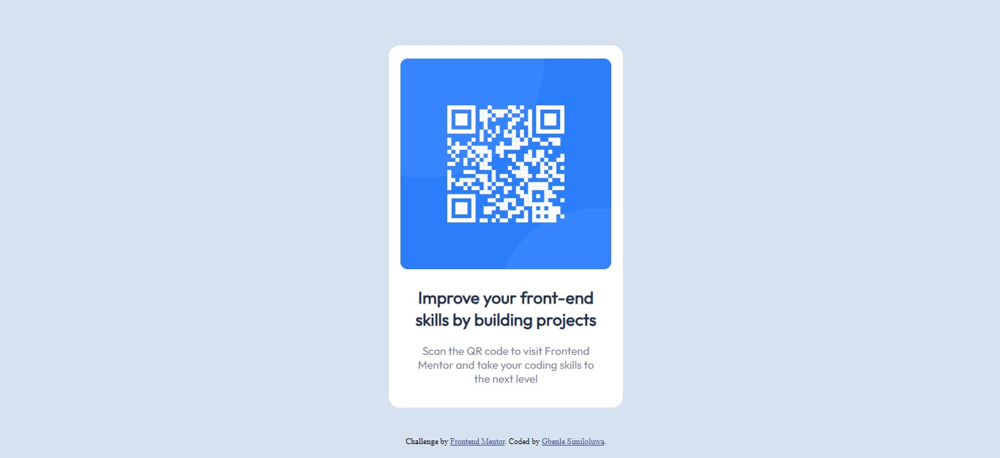

# QR-code-solution
# Frontend Mentor - QR code component solution

This is a solution to the [QR code component challenge on Frontend Mentor](https://www.frontendmentor.io/challenges/qr-code-component-iux_sIO_H). Frontend Mentor challenges help you improve your coding skills by building realistic projects. 

## Table of contents

- [Frontend Mentor - QR code component solution](#frontend-mentor---QR-code-component-solution)
  - [Table of contents](#table-of-contents)
  - [Overview](#overview)
    - [Screenshot](#screenshot)
    - [Links](#links)
  - [My process](#my-process)
    - [Built with](#built-with)
    - [What I learned](#what-i-learned)
    - [Continued development](#continued-development)
    - [Useful resources](#useful-resources)
  - [Author](#author)

## Overview

This is a solution to a Frontend Mentor challenge strictly using HTML and CSS. This has not only been useful to me in applying my knowledge but also in learning more and better approaches to use when coding.

### Screenshot

### Links

- Solution URL: [Add solution URL here](https://github.com/Similoluwa10/QR-code-solution.git)
- Live Site URL: [Add live site URL here](https://similoluwa10.github.io/QR-code-solution/)

## My process

I began by structuring the webpage using HTML
and then giving it proper styling and positioning using CSS.
I was able to centrally place the QR-code component using margin: auto, thus enabling it to be responsive to various browser widths. I also used Google Fonts to get the specified font families while the colours and font sizes were indicated. The application of padding, margins and border-radius, on the other hand, was based on intuition.

### Built with

- Semantic HTML5 markup
- CSS custom properties

### What I learned
One thing I learned through this project was how to make use of Git repositories.
I was also able to understand how to search for content online which I was told was a useful skill to a web developer.
Regarding HTML and CSS specifically, I gained better knowledge on how to make use of Google fonts and how to apply them on a webpage, as well as how making use of widths in percentages enhances your website responsivity.

<link href="https://I-finally-learnt-how-to-use-a-link.com">

### Continued development

Responsivity
Semantic HTML
Use of grid and flexbox

### Useful resources

- [Example resource 1](https://www.w3schools.com) - This material was helpful for me to refer to whenever I needed help in using a tag in HTML or a CSS style. I liked it and will use it going forward.
- [Example resource 2](https://medium.com/frontend-mentor/a-complete-guide-to-submitting-solutions-on-frontend-mentor-ac6384162248) - This is a fantastic article which served as a guide to submit my project.

## Author

- This project was done by Gbenle Similoluwa.
